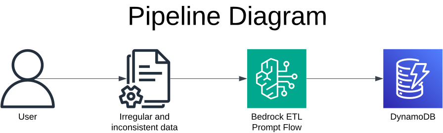
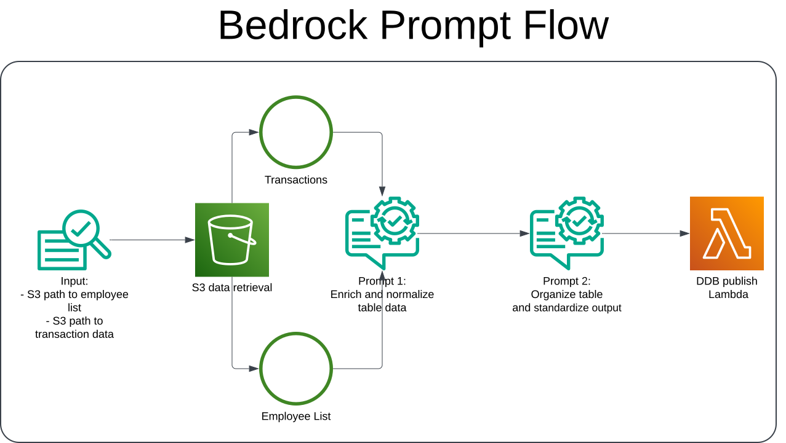

# ETL pipeline using Large Language Models
This is a demo that uses an LLM to extract and transform transaction data. It's aimed at processing inconsistent datasets that would otherwise require extensive consideration of edge cases. It leverages *AWS Bedrock Prompt Flows* to orchestrate the ETL job.

## Use case

While building data pipelines, I've had issues in the past with datasets that have inconsistent fields. Consider the example below:

timestamp |	name	| sales_total
--- | :---: | ---:
2024-11-15 08:23:45 |	JS |	54.75
2024-11-15 09:45:02 |	Galcia |	120.30
2024-11-15 10:12:58 |	E. Johnson |	89.99
2024-11-15 21:15:34 |	Mikey |	215.60
2024-11-15 13:05:21 |	Will |	39.45

The `name` column has entries that use initials, name collisions, nicknames and misspellings. The traditional data transformation tools would require considering every edge case possible or manually editing data, which is both time consuming and expensive. Instead, an LLM is capable of parsing a list of names and producing an output like this:


timestamp |	name	| sales_total
--- | :---: | ---:
2024-11-15 08:23:45 |	John Smith |	54.75
2024-11-15 09:45:02 |	Jane Garcia |	120.30
2024-11-15 10:12:58 |	Emily Johnson |	89.99
2024-11-15 21:15:34 |	Michael Brown |	215.60
2024-11-15 13:05:21 |	William Davis |	39.45


## Architecture Diagram
This demo uses *AWS* resources, especially *Bedrock Prompt Flows* to orchestrate the data extraction and transformation and outputs the cleaned data to a DynamoDB table.



The flow receives S3 paths to an employee list and transaction data as inputs and injects them in pre-built prompts that infer the necessary corrections.



## Instructions
### Requirements
- An AWS account with access to Bedrock's foundation models. To verify or request access to the models consult:
https://docs.aws.amazon.com/bedrock/latest/userguide/model-access-modify.html
- Installed and configured the AWS CLI
- Properly configured AWS access keys

> [!CAUTION]
> While the resources deployed in this repo are covered by the AWS Free Tier, invoking *AWS Bedrock* foundation models has an associated cost that depends both on the model used and the amount of tokens employed. Running this demo will cost you about 1 USD, so make sure your budget and billing alerts are configured appropriately.

### Deployment
The `iac/cfnStack.yaml` file contains a CloudFormation template that will deploy:
- Bedrock Prompts for curation and transformation
- The Bedrock Prompt Flow
- A data S3 Bucket
- DynamoDB table fot the output
- Lambda function that publishes the flow output to DynamoDB
- Appropriate minimum privilege IAM roles for Lambda and Bedrock

Use the `deploy.sh` script to create the stack and upload the sample files to S3. By default the stack is deployed to `us-east-1`, but this value can be changed in the script.

### Using the Prompt Flow
To invoke the flow: 
1. Navigate to the *AWS Bedrock* console and select the *Prompt Flows* menu. 
2. Open the `llm-etl-demo-flow`
3. Select the `Edit in flow builder` option
4. Input an array that contains:
    1. The names to use as reference
    2. The transactions to clean. Example: 

```
['employees.yaml','obfuscated_transactions.tsv']
```

### Cleanup
Use the `cleanup.sh` script to empty the S3 bucket and destroy all resources in the stack.

### Picking the right model
By default this demo uses the **Amazon Titan Text G1 Premier** model in order to minimize costs. However, since this pipeline is mainly about summarization and interpolation tasks most large language models with a big enough context window should be capable of producing a valid output.
